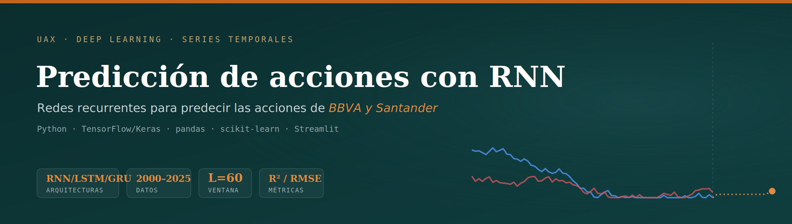
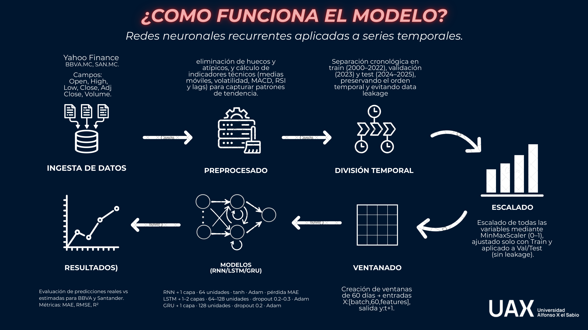
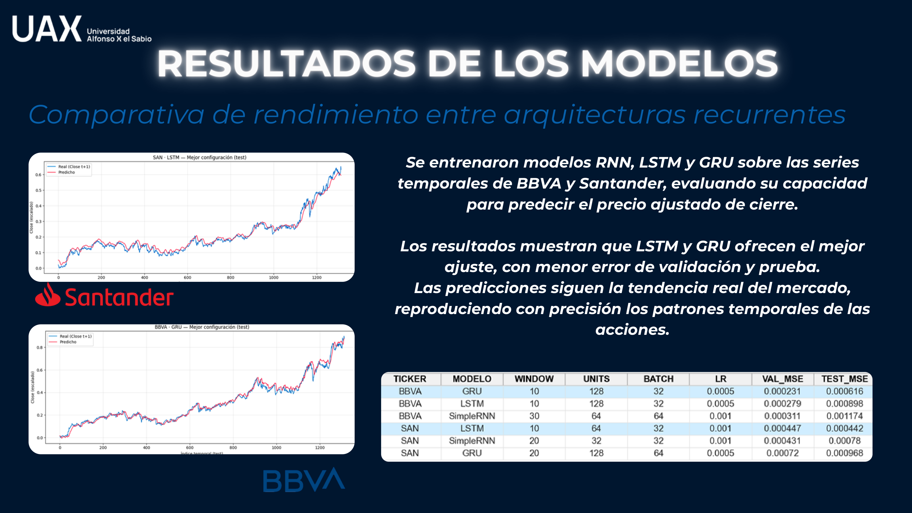

<p align="center">
  
</p>

<p align="center">
  <a href="docs/presentacion_RNN.pdf"><b>📊 Ver presentación completa del proyecto (PDF)</b></a>
</p>

<p align="center">
  
  
  
  
</p>

> Predicción de las acciones de **BBVA y Santander** mediante **redes neuronales recurrentes** (RNN, LSTM y GRU) aplicadas a series temporales financieras (2000–2025), con una app en Streamlit que convierte las predicciones en señales de apoyo a la decisión.

---

## 🎯 Objetivo

Anticipar la evolución del precio de cierre ajustado de dos de los principales valores del IBEX 35 a partir de su histórico bursátil, comparando distintas arquitecturas recurrentes y llevando el mejor modelo a una herramienta práctica de apoyo a la inversión.

## 🧠 Enfoque

El proyecto trata la cotización como una **serie temporal** y entrena redes recurrentes para aprender su dinámica:

- **Datos:** precios diarios (Open, High, Low, Close, Adj Close, Volume) de `BBVA.MC` y `SAN.MC` descargados de Yahoo Finance, periodo **2000–2025**.
- **Serie base:** Adj Close (ajustada por dividendos y *splits*).
- **Limpieza:** relleno de huecos cortos (*forward-fill*) y control de valores atípicos en los retornos.
- **Features:** retornos, volumen, medias móviles (5/20/60), volatilidad (20), MACD, RSI y *lags*.
- **Ventanas deslizantes:** secuencias de **L = 60 días** para predecir el día siguiente (`t+1`).
- **División temporal (sin *data leakage*):** Train (2000–2022), Validación (2023) y Test (2024–2025), respetando el orden cronológico.
- **Escalado:** `MinMaxScaler` ajustado **solo con Train** y aplicado a Val/Test.

## 🏗️ Modelos

Se entrenaron y compararon tres arquitecturas recurrentes:

| Modelo | Configuración |
|--------|---------------|
| **SimpleRNN** | 1 capa · 64 unidades · tanh · Adam · pérdida MAE |
| **LSTM** | 1–2 capas · 64–128 unidades · dropout 0.2–0.3 · Adam |
| **GRU** | 1 capa · 128 unidades · dropout 0.2 · Adam |

## 📊 Presentación del proyecto

**Pipeline de datos y modelado**



**Comparativa de resultados entre arquitecturas**



> 📄 Presentación completa disponible en [`docs/presentacion_RNN.pdf`](docs/presentacion_RNN.pdf).

## 📈 Resultados

Las arquitecturas **LSTM y GRU** ofrecieron el mejor ajuste, con menor error en validación y test, y predicciones que siguen fielmente la tendencia real del mercado. Mejores configuraciones por *test MSE*:

| Ticker | Modelo | Ventana | Unidades | Batch | LR | Val MSE | Test MSE |
|--------|--------|:------:|:-------:|:----:|:----:|:-------:|:--------:|
| BBVA | GRU | 10 | 128 | 32 | 0.0005 | 0.000231 | **0.000616** |
| SAN | SimpleRNN | 20 | 32 | 32 | 0.001 | 0.000431 | **0.000780** |
| SAN | LSTM | 10 | 64 | 32 | 0.001 | 0.000447 | 0.000442 |

> Métricas de evaluación: **MAE, RMSE y R²**, comparando precios reales frente a predichos para cada entidad.

## 🖥️ Aplicación (Streamlit)

La app convierte el modelo en una herramienta de apoyo a la decisión:

- Gráficas dinámicas de precios **reales vs. predichos**.
- **Recomendaciones automáticas:** Comprar (tendencia alcista), Mantener (sin señal clara) o Vender (tendencia bajista).
- **Indicadores de confianza** según la precisión del modelo (MAE/RMSE).
- Opción de **simular escenarios** futuros.

## 🛠️ Stack técnico

- **Lenguaje:** Python
- **Deep Learning:** TensorFlow / Keras (RNN, LSTM, GRU)
- **Datos y ML:** pandas, NumPy, scikit-learn, yfinance
- **Interfaz:** Streamlit
- **Indicadores técnicos:** medias móviles, volatilidad, MACD, RSI

## 📁 Estructura del repositorio

```text
Caso02_Predicciones_bancos/
├── data/                       # Datos crudos y procesados (BBVA, Santander)
├── notebooks/
│   ├── 01_Descarga_datos.ipynb
│   ├── 02_Preproceso_e_indicadores.ipynb
│   ├── 03_Baseline_regresion_lineal.ipynb
│   ├── 04_Secuencias_de_ventanas.ipynb
│   └── 05_Modelos.ipynb
├── reports/baseline/           # Métricas y predicciones del baseline
├── streamlit_app/              # Aplicación interactiva
│   ├── app.py
│   └── components.py
├── docs/                       # Banner, slides y presentación
├── requirements.txt
├── runtime.txt
└── README.md
```

## ⚠️ Aviso

Proyecto académico con fines educativos. Las predicciones **no constituyen recomendaciones de inversión**: los mercados financieros son inherentemente impredecibles y el rendimiento pasado no garantiza resultados futuros.

## 👤 Autora

**Lucía Cantos Burgos** — Grado en Ingeniería Matemática, Universidad Alfonso X El Sabio
[GitHub](https://github.com/luciacantos)
